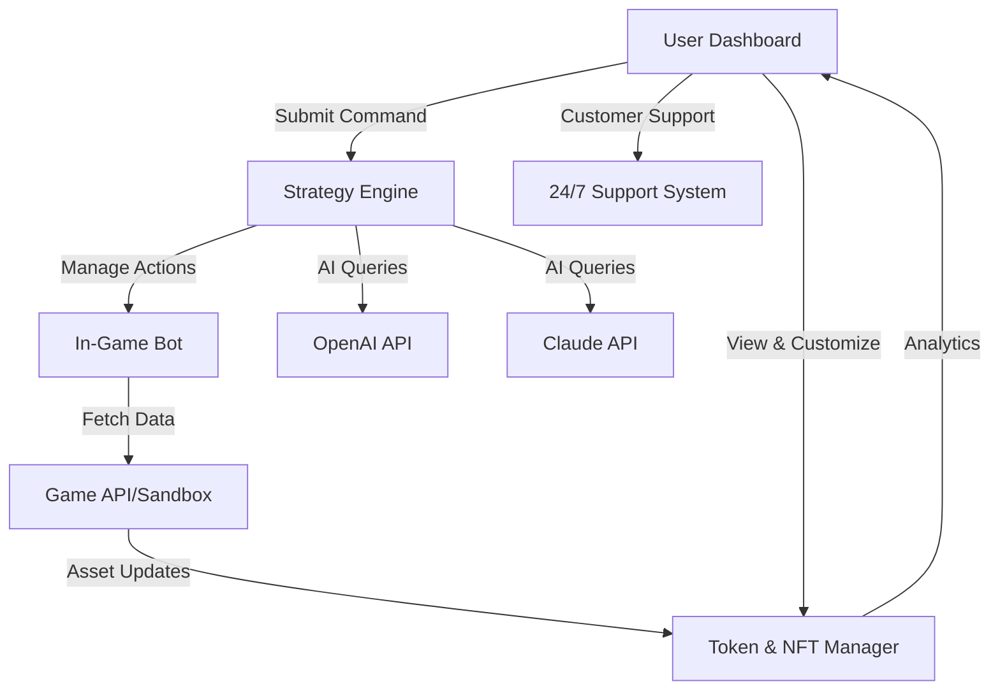

# Crypto-Game-Sandbox Assistant 🚀🎮

**Automated Strategy Engine for Blockchain Sandbox Games**  
A next-generation assistant for streamlined gameplay, NFT asset management, and dynamic in-game strategy in top metaverse and virtual-world games.

---

# Table of Contents
- [Project Overview 🌍](#project-overview-🌍)
- [Features & Benefits ✨](#features--benefits-✨)
- [SEO-Optimized Use Case Keywords 🏷️](#seo-optimized-use-case-keywords-🏷️)
- [Mermaid Diagram: Workflow Architecture 📊](#mermaid-diagram-workflow-architecture-📊)
- [Supported Platforms 🖥️](#supported-platforms-🖥️)
- [Example Profile Configuration ✏️](#example-profile-configuration-✏️)
- [Example Console Invocation 💻](#example-console-invocation-💻)
- [API Integration 🌐](#api-integration-🌐)
- [Multilingual & Responsive UI Support 🌎](#multilingual--responsive-ui-support-🌎)
- [24/7 Customer Support ☎️](#247-customer-support-☎️)
- [Disclaimer 📜](#disclaimer-📜)
- [License 📝](#license-📝)
- [Download & Quickstart 📥](#download--quickstart-📥)

---

## Project Overview 🌍

Crypto-Game-Sandbox Assistant is an autonomous companion designed for blockchain-powered metaverse and NFT-based games. Utilize advanced strategies to enhance gameplay enjoyment, optimize NFT resource management, and connect seamlessly to both OpenAI and Claude AI for in-game guidance, analysis, and creative decision support. 

Step into the future of interactive gaming: automate, strategize, and personalize your experience like never before.

---

## Features & Benefits ✨

- 🎮 **Automated Farming & Resource Optimization:** Let your digital farm flourish while you focus on exploration or creativity.
- 🤖 **Dynamic In-Game Strategy Engine:** Adjusts actions based on live game events and your unique playing style.
- 🔑 **Secure Blockchain Token Wallet Manager:** Manage in-game tokens, NFTs, and assets without exposing private keys or personal data.
- 📊 **Analytics Dashboard:** Track in-game performance, token flow, and even predicted market trends, all in real time.
- 🔄 **API Integrations:** Connect to third-party AI platforms like OpenAI and Claude for context-aware advice and decision support.
- 🗺️ **Multilingual Support:** Play in your preferred language - currently supporting English, Spanish, Mandarin, and more!
- 🖥️ **Responsive UI:** Access a modern, mobile-friendly dashboard from any device.
- 🌐 **24/7 Customer Experience:** Need help? Reach out anytime through our integrated live support system.
- 🛠️ **Modular Plug-in Architecture:** Extend functionality with custom plugins for your favorite games or metaverse platforms.

---

## SEO-Optimized Use Case Keywords 🏷️

Blockchain gaming automation, NFT asset manager, metaverse game companion, crypto token wallet, game strategy AI, automated resource farming, virtual world analytics, NFT farming assistant, real-time token dashboard, multilingual metaverse platform, AI game advisor, OpenAI in gaming, Claude API gaming integration, responsive NFT dashboard, cross-platform game assistant.

---

## Mermaid Diagram: Workflow Architecture 📊

The following diagram illustrates the core architecture, including user interaction, blockchain data flow, AI integration, and support path.

---

## Supported Platforms 🖥️

| Operating System | CLI | GUI | Notification Support |
|------------------|:---:|:---:|:-------------------:|
|  | ✅ | ✅ | ✅ |
|  | ✅ | ✅ | ✅ |
|  | ✅ | ✅ | ✅ |
|  | ❌ | ✅ | ✅ |
|  | ❌ | ✅ | ✅ |

---

## Example Profile Configuration ✏️

Personalize your strategic assistant for seamless in-game operations:

    profile:
      player_name: "MetaverseExplorer"
      preferred_language: "en"
      target_game: "Sandbox Alpha"
      api_keys:
        openai: "OPENAI-EXAMPLE-KEY"
        claude: "CLAUDE-EXAMPLE-API-KEY"
      nft_wallet:
        address: "0x1234abcd5678ef9012345678abcdef0123456789"
        preferred_tokens: ["SAND", "MANA"]
      automation:
        farming_enabled: true
        asset_scanner: true
      analytics:
        enable_market_tracker: true
        
---

## Example Console Invocation 💻

To launch the assistant with a custom configuration, run:

    crypto-game-assistant --config /path/to/profile.yaml --dashboard

You can also initiate with advanced AI support only:

    crypto-game-assistant --ai-support-only

---

## API Integration 🌐

This project seamlessly connects with:

- **OpenAI API**: For smart in-game tips, creative mission ideas, and decision making.
- **Claude API**: Augments conversational support, provides analysis and in-game lore insights.
- **Custom Game APIs**: Leveraging RESTful calls for action automation and resource monitoring.

API credentials can be managed securely in your profile configuration. All exchanges are end-to-end encrypted for peace of mind.

---

## Multilingual & Responsive UI Support 🌎
Enjoy a fully translated and adaptive interface! Simply set your desired language in the configuration and the UI automatically adjusts. The design philosophy ensures a smooth experience whether on desktop, tablet, or mobile.

Languages currently available:  
🇬🇧 English · 🇪🇸 Español · 🇨🇳 中文 · 🇫🇷 Français · 🇯🇵 日本語 · and more!

---

## 24/7 Customer Support ☎️

Round-the-clock support is only a click away. Get real-time help, detailed documentation, and regular updates from our global team right within the dashboard — enhancing your gameplay journey, day or night.

---

## Disclaimer 📜

Crypto-Game-Sandbox Assistant is an independent tool, crafted to augment user experience and promote fair game automation and NFT management within supported environments.  
**Please respect each game's Terms of Service and relevant community guidelines.**  
All interactions with blockchain wallets and third-party APIs are performed with user permission and local security assurances.  
Use at your own discretion. This software comes with no guarantees concerning profit, reward, or competitive advantage.

---

## License 📝

This project is licensed under the MIT License. Please see [LICENSE](https://opensource.org/licenses/MIT) for details.  
© 2026 Crypto-Game-Sandbox Assistant Contributors

---

## Download & Quickstart 📥

Get started by downloading the latest release here:  

For installation instructions, usage guides, and updates, check the [documentation](#).

---

Happy strategizing in the metaverse! 🌟